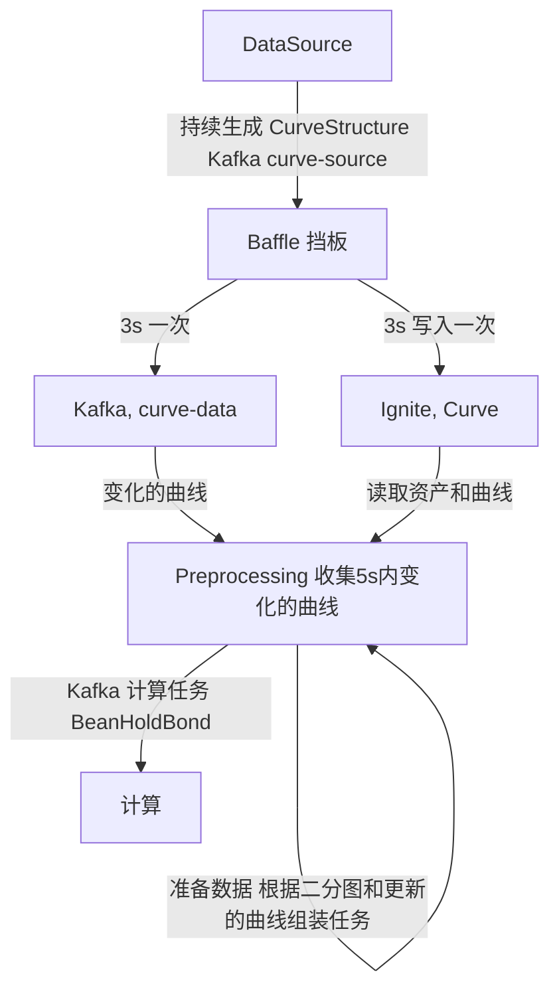
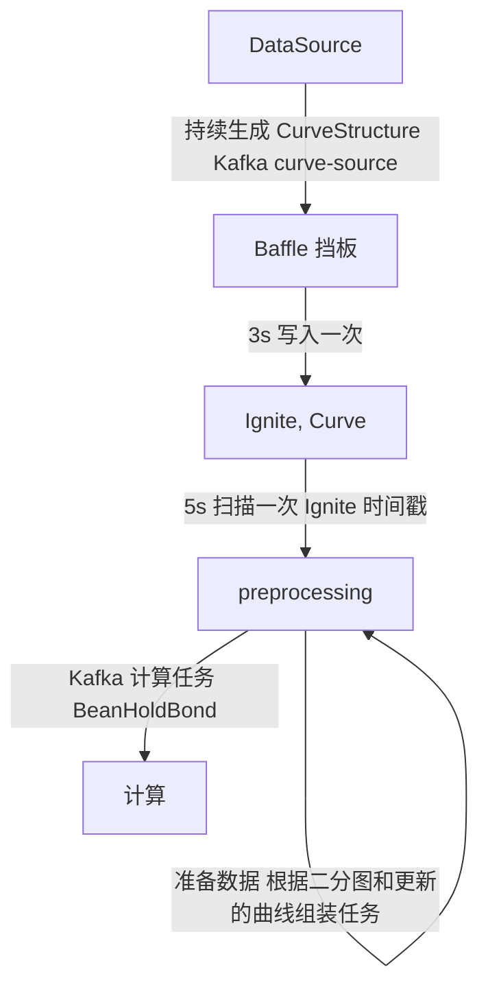
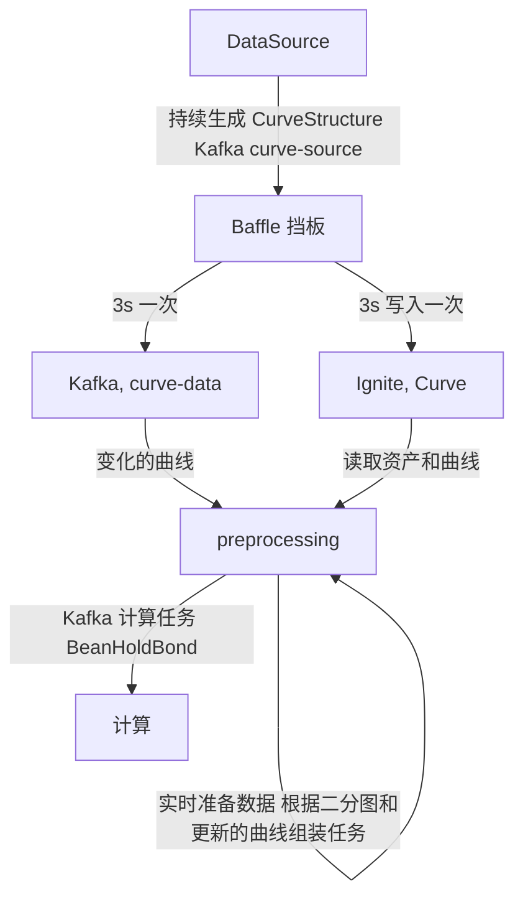
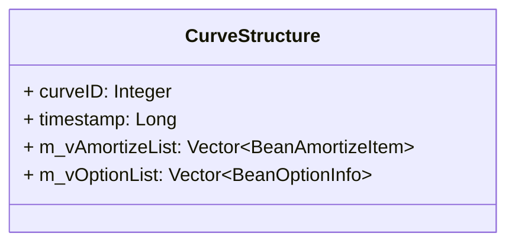

## 方案一

## 方案二

## 方案三

## 1. DataSource(数据源)

#### 数据生成

每间隔 $t$ s 生成一次 `CurveStructure`，`ID` 随机，内容随机

#### 数据发送

- 类型： `CurveStructure`
- kafka
	- topic: `curve-source`

## 2. Baffle(挡板)

#### 数据来源

- 类型： `CurveStructure`
- Kafka
	- topic: `curve-source`
	- group: `baffle`

#### 数据处理

收集 3s 内的曲线数据，对于每条曲线，保留最新的值

#### 数据发送

Kafka 发送曲线 ID，Ignite写入曲线值

- Kafka（方案1、3）
	- 类型： `Integer`
	- topic: `curve-data`
- Ignite
	- 类型： `CurveStructure`
	- cache: `Curve`

## 3. Preprocessing(预处理)

#### 数据来源

##### 方案1，3

- 类型： `Interge`
- Kafka
	- topic: `curve-data`
	- group: `preprocessing`
- 类型： `CurveStructure`
- Ignite
	- cache: `Curve`
- 类型： `PropertyStructure`
- Ignite
	- cache: `Property`
##### 方案2
- 类型： `CurveStructure`
- Ignite
	- cache: `Curve`
- 类型： `PropertyStructure`
- Ignite
	- cache: `Property`

#### 数据处理

##### 方案1

收集 `5s` Kafka 来的曲线ID，根据曲线 ID和二分图，从 Ignite 中读取资产和曲线，组合成为 `BeanHoldBond`

##### 方案2

每间隔 `5s` 从Ignite中根据时间戳扫描更新的曲线，然后通过二分图找到所需的资产和曲线，组合成为 `BeanHoldBond`

##### 方案3

实时读取 Kafka 来的曲线 ID，从 Ignite 中读取资产和曲线，组合成为 `BeanHoldBond`。流式发送到下游

#### 数据发送

- 类型： `BeanHoldBond`
- Kafka
	- topic: `bond-data`

## 4. Computing(计算)

#### 数据来源

- 类型： `BeanHoldBond`
- Kafka
	- topic: `bond-data`
	- group: `computing`

#### 数据处理

使用 `FlinkTestCal.calSingleBond4Stream` 方法计算

#### 数据发送

无

**所涉及的 Ignite Cache 名和 Kafka Topic Group 名均已在 `IgniteCacheConfig` 和 `KafkaConfig` 中定义**
